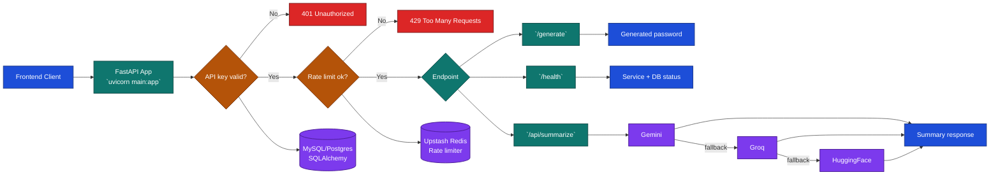

# EGOR

This is the minimal setup for the EGOR application.

## Version 1 - 2026-04-03

.png)

## System Architecture Diagram

```mermaid
flowchart LR
    classDef client fill:#1d4ed8,stroke:#1e3a8a,stroke-width:1.5px,color:#fff;
    classDef app fill:#0f766e,stroke:#134e4a,stroke-width:1.5px,color:#fff;
    classDef security fill:#b45309,stroke:#78350f,stroke-width:1.5px,color:#fff;
    classDef data fill:#7c3aed,stroke:#4c1d95,stroke-width:1.5px,color:#fff;
    classDef error fill:#dc2626,stroke:#7f1d1d,stroke-width:1.5px,color:#fff;

    Client[Frontend Client]:::client --> API[FastAPI App<br/>`uvicorn main:app`]:::app

    API --> KeyCheck{API key valid?}:::security
    KeyCheck -->|No| Unauthorized[401 Unauthorized]:::error
    KeyCheck -->|Yes| LimitCheck{Rate limit ok?}:::security

    LimitCheck -->|No| TooMany[429 Too Many Requests]:::error
    LimitCheck -->|Yes| Route{Endpoint}:::app

    DB[(MySQL/Postgres<br/>SQLAlchemy)]:::data
    Redis[(Upstash Redis<br/>Rate limiter)]:::data

    KeyCheck --> DB
    LimitCheck --> Redis

    Route --> Gen[`/generate`]:::app
    Route --> Sum[`/api/summarize`]:::app
    Route --> Health[`/health`]:::app

    Gen --> Password[Generated password]:::client
    Health --> HealthOK[Service + DB status]:::client

    Sum --> Gemini[Gemini]:::data
    Gemini -->|fallback| Groq[Groq]:::data
    Groq -->|fallback| HF[HuggingFace]:::data
    Gemini --> Summary[Summary response]:::client
    Groq --> Summary
    HF --> Summary
```
